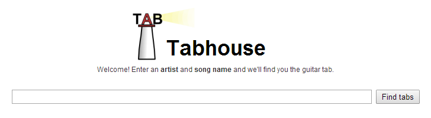
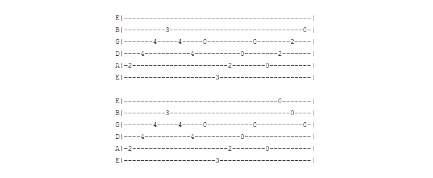

Tabhouse
========

A web application that lets you find quality guitar tabs. It does so by sending
a search request to Google, parsing the top page results, and displaying the
most common match on a clean, printer-friendly page without noise.

Here's an example rendered tab.

http://tabhouse.org

History
-------

This web application uses code from an old command-line version of the project,
written in 2006. I rewrote this using [Flask](http://flask.pocoo.org) to learn
about the framework and get a better feel for writing modern web applications.

Some of the original code was changed, mostly as a result of refactoring.
